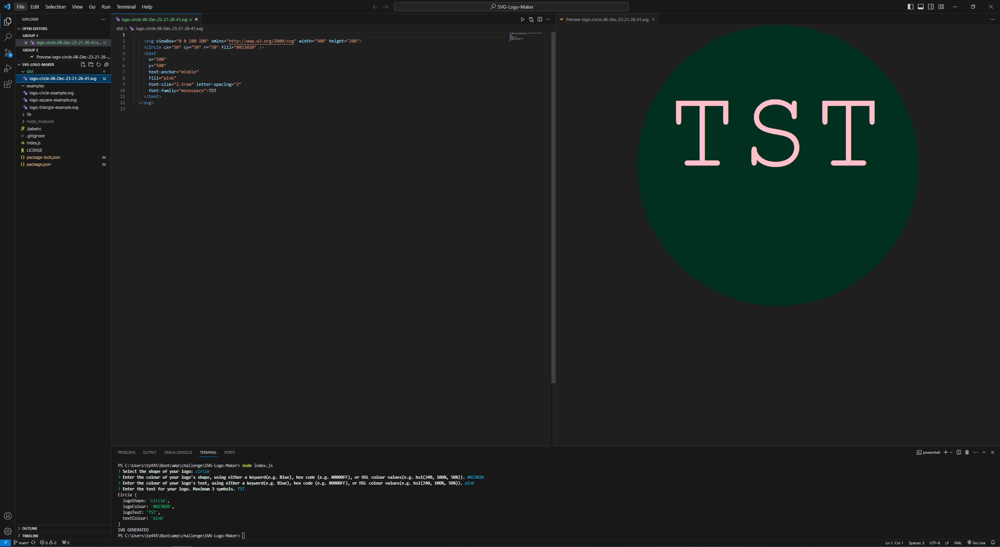

# SVG logo generator - edX bootcamp challenge #10

## Description

This application will generate a 200x300 .SVG file using input from the user into the command line interface. A series of prompts will be displayed, asking the user to select the shape of logo, it's color, displayed text and color of the text. Once prompts are completed a new .SVG file will be generated and saved into the /dist folder. Samples of generated files can be seen in /examples folder.

## Table of Contents
* [Product Demonstration](<#product-demonstration>)
* [Installation](#installation)
* [Usage](#usage)
* [Contributing](#contributing)
* [Tests](#tests)
* [Questions](#questions)
* [License](#license)

## Product Demonstration

Because this application won't be deployed, please view the attached video demonstrating it's functionality.

[SVG Generator Video Demo](https://drive.google.com/file/d/1cm7ulq76Zv9i06az1bUU_n3FozqviDs1/view?usp=sharing)

## Installation

* Clone the repository, or download and extract the zip file:
    >[git@github.com:TP4458/SVG-Logo-Maker.git](git@github.com:TP4458/SVG-Logo-Maker.git)  
    >  
    >[https://github.com/TP4458/SVG-Logo-Maker/archive/refs/heads/main.zip](https://github.com/TP4458/SVG-Logo-Maker/archive/refs/heads/main.zip)
* Navigate to the folder containing the files using your CLI.
* Run npm install
* Run node index.js

## Usage
On starting the application user will be met wit a series or prompts:
* Select the shape of the logo from a list. Currently a triangle, square and a circle are available.
* Select the color of the logo. this can be done by typing in any css3-compatible color code, a hex code, of HSL values.
* Type in text to display over the selected shape. maximum of 3 characters are allowed.
* Select the color of the text.

Upon completing the prompts a nev .SVG file will be saved to /Dist folder. Each file name contains a type of logo created and a time stamp.

## Contributing

To contribule to this project you can contact me using the links found in [Questions](#questions) section.

## Tests

Tests have been run using Jest for a `render()` method to return a string for the corresponding SVG file with the given shape color. Validation functions for provided text and color are also tested in the same script.

## Questions
Any questions regarding this project can be directed to:
* Email: [tp4458@gmail.com](tp4458@gmail.com)
* GitHub [TP4458](https://github.com/TP4458)

## License
This product is licensed with MIT License. Please click on the badge below, or at the top of this document to find out more.

 
